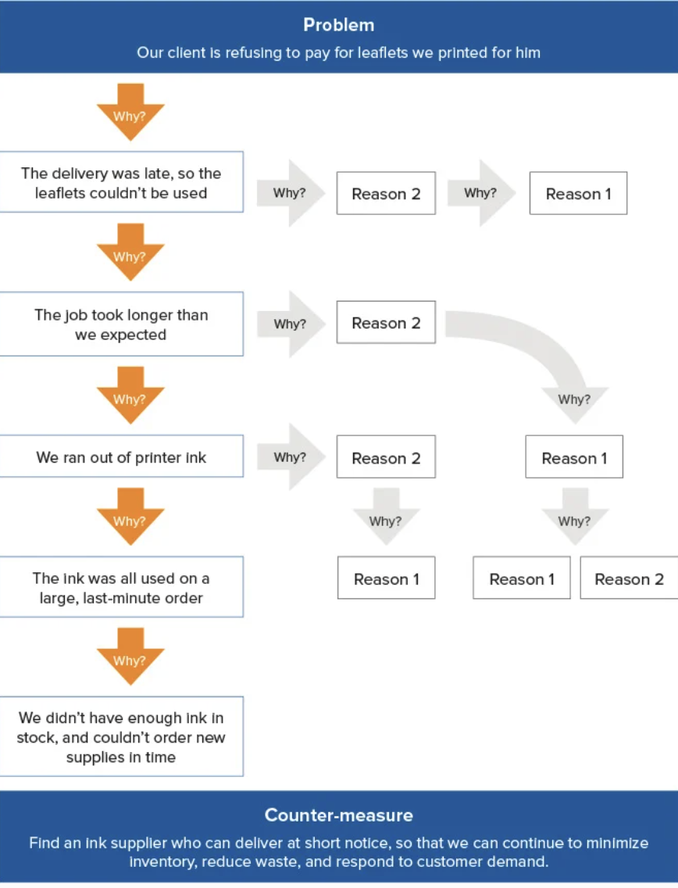

# [How to Solve Programming Problems](https://simpleprogrammer.com/solving-problems-breaking-it-down/)

## Common Mistakes (interviews)
    1. Improper allocation of time
    1. Trying to write code as soon as possible
    1. Must resist the urge
    1. Make sure you take enough time to understand the problem completely before attempting to solve it
    1. Trying to over solve the solution on the first try

## Simple Steps To Solve Programming Problems
    1.	Read the problem twice
    2.	Solve manually with 3 sets of sample data
    3.	Optimize the manual steps
    4.	Write the manual steps as comments or pseudo-code
    5.	Replace the comments or pseudo-code w/ real code
    6.	Optimize the real code

**Spend at least 70% on steps 1-3**

> **“Nothing can be automated that cannot be done manually!”**

-	Programming is automation.

## The [Mathematical Induction]( https://en.wikipedia.org/wiki/Mathematical_induction) Approach
-	Use this to solve for step 1 first, then 2

# [Pretend Your Time Is Worth $1000/Hour & You’ll Become 100x More Productive]( https://medium.com/swlh/pretend-your-time-is-worth-1-000-hour-and-youll-become-100x-more-productive-f04628bb3e6d)

If your time was worth this amount…
- What would your life look like?
-	What people would you stop putting up with?
-	What problems would you stop wasting time on?
-	What things would you stop — and start — doing?

> **“Busyness” Isn’t a Badge of Honor; It’s a Sign of Weakness**

> **“Being busy is a form of mental laziness.” -Tim Ferriss**

> **“Indeed the state of all who are preoccupied is wretched, but the most wretched are those who are toiling not even at their own preoccupations…If such people want to know how short their lives are, let them reflect how small a portion is their own.”**

**Busyness & Stress Are The Enemy**

> **“People are unhappy in large part because they are confused about what is valuable.” -William Irvine**

> **“Busyness and exhaustion should be your enemy. If you’re chronically stressed and up late working, you’re doing something wrong. Do less. But do what you do with complete, hard focus. Then when you’re done be done, and go enjoy the rest of your day.”**

> **“The difference between successful people and really successful people is that really successful people say no to almost everything.” -Warren Buffet**

> **“People think focus means saying yes to the thing you’ve got to focus on. But that’s not what it means at all. It means saying no to the hundred other good ideas that there are. You have to pick carefully. I’m actually as proud of the things we haven’t done as the things I have done. Innovation is saying no to 1,000 things.”**
> - Steve Jobs

# [How To Think Like A Programmer]( https://www.freecodecamp.org/news/how-to-think-like-a-programmer-lessons-in-problem-solving-d1d8bf1de7d2/)

-	Best way to solve a problem:
1.	Have a framework
2.	Practice it

[Think Like a Programmer: An Introduction to Creative Problem Solving
](https://www.amazon.com/dp/1593274246/?tag=richardreeze-20)

> **“The biggest mistake I see new programmers make is focusing on learning syntax instead of learning how to solve   problems.” — V. Anton Spraul**

> **“If you can’t explain something in simple terms, you don’t understand it.” — Richard Feynman**

1. Understand
2. Plan
3. Divide
4. Stuck?
5. Practice

# [The 5 Why’s](https://www.mindtools.com/pages/article/newTMC_5W.htm)

-	Technique developed by Sakichi Toyoda in the 1930’s to drill down on problems
-	Decision making is based on in-depth. Understanding of what’s actually happening
-	Uses counter-measures rather than solutions
-	May not always be suitable for some problems (complex or critical) because it may lead one to only focus on a single track or limited amount
o	There may be multiple causes
o	Should use cause & effect analysis or failure mode & effects analysis instead

**How To Use the 5 Whys**
1.Assemble A Team
2.Define the Problem
3.Ask the First “Why?”
4.Ask “Why?” Four More Times

5.Know When To Stop
    -You may reach the root cause before the 5th why

